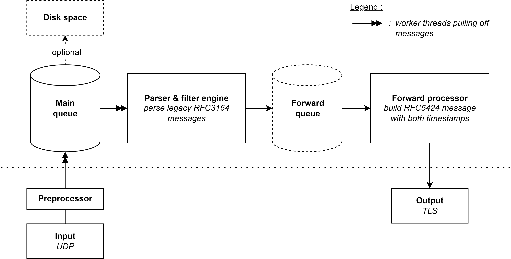

# A reliable IOx syslog relay

A resilient syslog relay that operates downstream of applications, collect their
syslog messages and send them to a central syslog server. Several mechanisms such
as the use of the TCP protocol and the retention of messages in case of connection
loss guarantee reliability.
The implementation, in the form of a proof of concept, is deployable inside a router
running the Cisco IOx environment and features the modern syslog message engine,
rsyslog.

## Getting Started
Several bash scripts are available to facilitate the commissioning of the IOx application.
The step by step installation is available below.

### Prerequisites
Generate all certificates (see [certificates](gen-certs/) folder).

Pack the application using the `./build.sh` script inside the [application](iox-application/) folder. Requires the [ioxclient](https://developer.cisco.com/docs/iox/#!iox-resource-downloads/downloads) tool provided by Cisco.

### Installation

Deploy the package on the Local Manager of the router.

Set the necessary resources then configure all the parameters from the "App-config" tab. Requires to upload the key and the certificate of the client in the data directory of the IOx application.

### Troubleshoot

If desired, the scripts in the [input-output](io/) folder can be used to generate logs and collect them. This is particularly useful for testing the environment quickly.
It is also possible to launch the Elasticsearch-Kibana service locally from the [statistics collector](stats-collector/) folder to capture the internal counters of the relay.

## Contributing
Pull requests are welcome. For major changes, please open an issue first to discuss what you would like to change.

## License
Distributed under the [GPLv3](https://choosealicense.com/licenses/gpl-3.0/) License.
If you intend to use it inside non-GPLv3 compatible project, please read [this](https://www.rsyslog.com/doc/v8-stable/licensing.html) very carefully.
